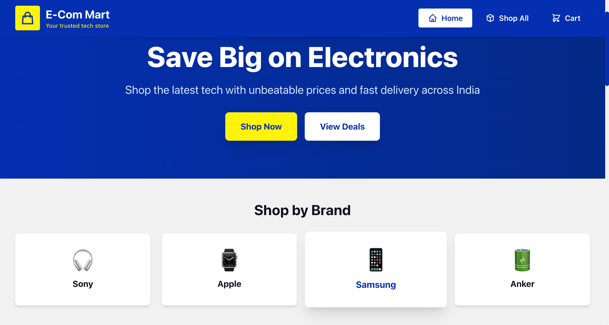
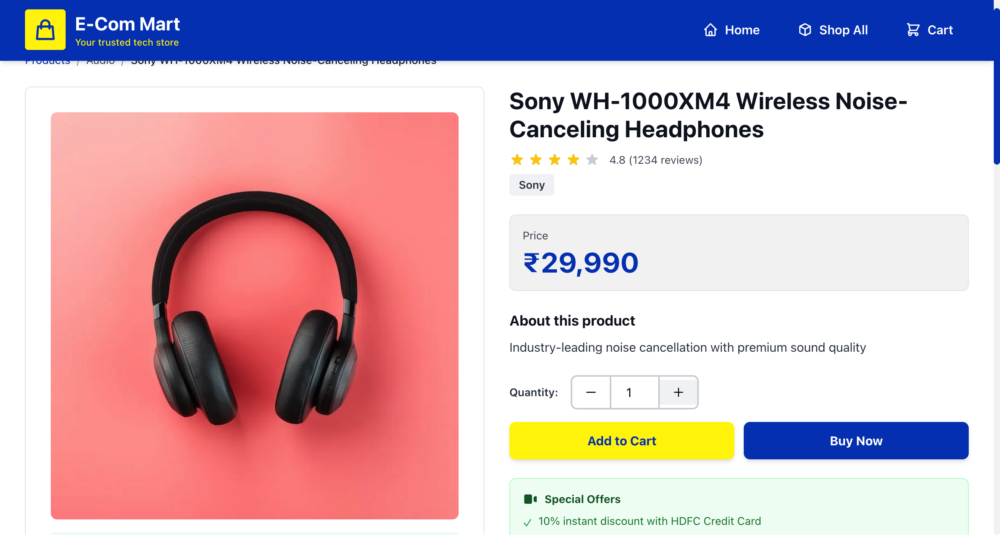
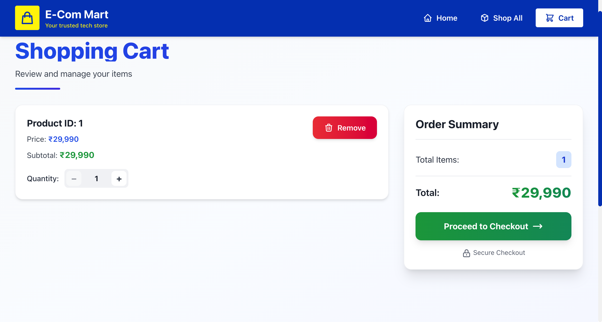
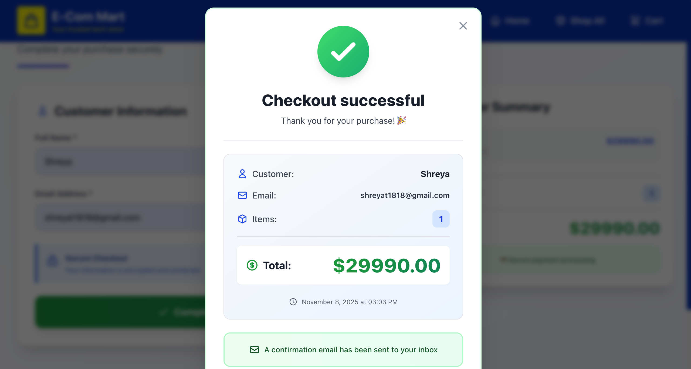
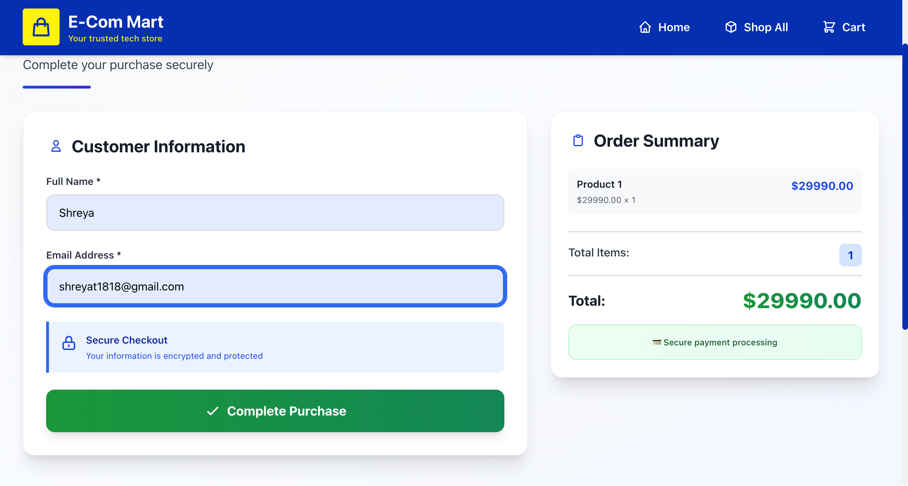

# 🛒 Vibe Commerce - Full Stack E-Commerce Shopping Cart

A modern, full-stack shopping cart application built for Vibe Commerce screening with Best Buy-inspired design. Features complete product browsing, cart management, checkout flow, and MongoDB persistence.

## 📸 Screenshots

### Home Page

*Modern landing page with category navigation and search*

### Products Catalog

*12 products with filters, sorting, and search functionality*

### Product Details

*Detailed product view with specifications, offers, and recommended products*

### Shopping Cart

*Cart with quantity controls, coupon system, and real-time totals*

### Checkout

*Secure checkout form with order summary*

### Order Confirmation

*Order confirmation modal with receipt details*

---

## 🎯 Assignment Requirements Checklist

### ✅ Backend APIs (All Implemented)
- ✅ **GET /api/products** - Fetch all products (12 items with full details)
- ✅ **POST /api/cart** - Add items to cart with quantity
- ✅ **DELETE /api/cart/:id** - Remove items from cart
- ✅ **GET /api/cart** - Get cart items with calculated total
- ✅ **POST /api/checkout** - Process checkout and generate receipt

### ✅ Frontend (React)
- ✅ **Products Grid** - Displays all products with "Add to Cart" buttons
- ✅ **Cart View** - Shows items, quantities, totals with update/remove buttons
- ✅ **Checkout Form** - Name & email inputs with validation
- ✅ **Receipt Modal** - Displays order confirmation with total & timestamp
- ✅ **Responsive Design** - Mobile-first, works on all screen sizes

### ✅ Bonus Features (All Implemented)
- ✅ **MongoDB Database Persistence** - All data stored in MongoDB
- ✅ **Mock User System** - User model with cart, wishlist, orders
- ✅ **Error Handling** - Centralized error middleware
- ✅ **Fake Store API Integration** - External API integration route

### ✅ Additional Features (Beyond Requirements)
- ✅ **Product Details Page** - Full specifications, shipping info, related products
- ✅ **Filters & Search** - Category, type, price range, search functionality
- ✅ **Coupon System** - 4 working coupons (FLAT10, NEWUSER, SAVE50, FREESHIP)
- ✅ **Quantity Controls** - +/- buttons in cart for easy updates
- ✅ **Best Buy Theme** - Professional blue (#0046BE) and yellow (#FFF200) design
- ✅ **Indian Rupees (₹)** - Currency formatting throughout
- ✅ **Local Images** - 6 WebP product images in public folder
- ✅ **Order History** - Orders saved to database with timestamps

---

## 🚀 Tech Stack

### Frontend
- **React** 18.2.0 - UI framework
- **React Router** 6.20.0 - Client-side routing
- **Axios** 1.6.2 - HTTP client for API calls
- **TailwindCSS** 3.3.6 - Utility-first CSS framework
- **Vite** 5.0.8 - Build tool and dev server

### Backend
- **Node.js** - JavaScript runtime
- **Express** 4.18.2 - Web framework
- **MongoDB** - NoSQL database
- **Mongoose** 8.0.3 - MongoDB ODM
- **CORS** 2.8.5 - Cross-origin resource sharing
- **dotenv** 16.3.1 - Environment variables

---

## 📁 Project Structure

```
e-com-mart/
├── backend/
│   ├── models/
│   │   ├── Product.js          # Product schema
│   │   ├── CartItem.js         # Cart item schema
│   │   ├── Order.js            # Order schema
│   │   └── User.js             # User schema (bonus)
│   ├── routes/
│   │   ├── productRoutes.js    # Product APIs
│   │   ├── cartRoutes.js       # Cart & checkout APIs
│   │   ├── authRoutes.js       # Auth APIs (bonus)
│   │   └── fakeStoreRoutes.js  # External API (bonus)
│   ├── middleware/
│   │   └── errorHandler.js     # Error handling (bonus)
│   ├── seed.js                 # Database seeding script
│   ├── cleanup-cart.js         # Cart cleanup utility
│   ├── server.js               # Express server
│   ├── .env                    # Environment variables
│   └── package.json
│
├── frontend/
│   ├── src/
│   │   ├── components/
│   │   │   ├── Home.jsx        # Landing page
│   │   │   ├── Products.jsx    # Products grid
│   │   │   ├── ProductDetails.jsx  # Product detail view
│   │   │   ├── Cart.jsx        # Shopping cart
│   │   │   ├── Checkout.jsx    # Checkout form
│   │   │   ├── ReceiptModal.jsx    # Order receipt
│   │   │   ├── FiltersSidebar.jsx  # Product filters
│   │   │   └── PriceRangeSlider.jsx    # Price filter
│   │   ├── utils/
│   │   │   └── api.js          # API client functions
│   │   ├── App.jsx             # Main app component
│   │   └── main.jsx            # React entry point
│   ├── public/
│   │   └── *.webp              # Product images (6 files)
│   ├── index.html
│   ├── package.json
│   └── vite.config.js
│
├── screenshots/                 # App screenshots (create this)
├── README.md                    # This file
└── HOW_TO_RUN.md               # Detailed setup guide
```

---


---

## 👨‍💻 Developer

**Shreya Tiwari**  
Full Stack Developer

- GitHub: [@yShreyat81](https://github.com/Shreyat81)
- Email: shreyat1818@gmail.com

---

## 📄 License

This project is created for Vibe Commerce screening assignment.


---

**Note**: This is a screening assignment project demonstrating full-stack development skills. All product data is mock/dummy data for demonstration purposes.
